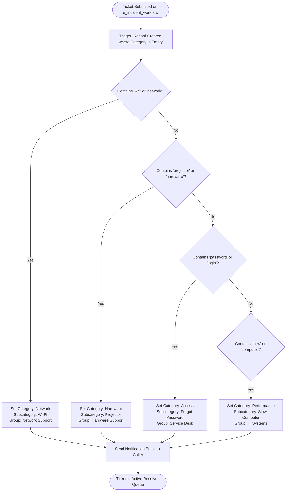

# 🎓 Auto Classify School IT Tickets
### Intelligent Incident Management & Automated IT Helpdesk on ServiceNow

[](https://developer.servicenow.com)
[](https://developer.servicenow.com)
[](https://portal.naanmudhalvan.tn.gov.in)
[](LICENSE)

An end-to-end Automated Incident Management system tailored for schools, colleges, and educational institutions. Built using **ServiceNow Flow Designer**, **Custom Table Workflows (`u_incident_workflow`)**, and **Role-Based Access Control (ACLs)** to eliminate manual helpdesk triage delays and automatically route campus IT issues to specialized support teams.

---

## 🚀 Live Demo & Submission Links

| Item | Link / Instructions |
|---|---|
| **🌐 Live Web Demo** | [Launch Interactive Portal](https://kanagarajperumal0-sys.github.io/tnskill/) |
| **📦 Update Set XML** | [`sys_remote_update_set_7a14952683238710667ea9e0deaad3f2.xml`](./sys_remote_update_set_7a14952683238710667ea9e0deaad3f2.xml) |
| **📄 Milestone 1 PDF Report** | [Download Milestone 1 PDF](./project_reports/Milestone_1_Requirement_Analysis_and_Plan.pdf) |
| **📄 Milestone 2 PDF Report** | [Download Milestone 2 PDF](./project_reports/Milestone_2_System_Design_and_Flow_Implementation.pdf) |
| **📄 Milestone 3 PDF Report** | [Download Milestone 3 PDF](./project_reports/Milestone_3_Testing_and_Deployment_Guide.pdf) |
| **📑 Final Project Report PDF** | [Download Complete Final Report PDF](./project_reports/Final_Project_Report_Auto_Classify_School_IT_Tickets.pdf) |
| **🛠️ ServiceNow Setup Guide** | [`docs/ServiceNow_Deployment_Guide.md`](./docs/ServiceNow_Deployment_Guide.md) |
| **🧪 Test Cases & Results** | [`docs/Test_Cases_and_Validation.md`](./docs/Test_Cases_and_Validation.md) |

---

## 📌 Problem Statement & Objectives
Educational institutions face high volumes of daily IT trouble tickets:
- Wi-Fi and network drops during online lectures and examinations.
- Projector and display cable faults in smart classrooms.
- Password lockouts on student examination portals.
- Laboratory computer workstation slowdowns and crashes.

**Key Objectives:**
1. **Zero Manual Triage:** Automatically categorize and sub-categorize tickets without human intervention.
2. **Instant Team Routing:** Dynamically assign tickets to designated resolver groups (`Network Support`, `Hardware Support`, `Service Desk`, `IT Systems`).
3. **Automated Caller Communication:** Dispatch transactional email notifications confirming ticket creation and expected SLA.
4. **Credential Self-Service:** Provide integrated password reset workflows for student/faculty accounts.

---

## ⚙️ Architecture & Solution Overview



---

## 🗄️ ServiceNow Components in Update Set

The included ServiceNow XML update set (`sys_remote_update_set_7a14952683238710667ea9e0deaad3f2.xml`) contains:

1. **Custom Database Table:**
   - Name: `Incident WorkFlow` (`u_incident_workflow`)
   - Auto-number Prefix: `INC` (e.g. `INC0001001`)
2. **Fields & Dictionaries:**
   - `u_number` (String) - Auto-generated incident number
   - `u_reference_1` (Reference ➔ `sys_user`) - Incident Caller
   - `u_short_description` (String) - Issue summary evaluated by flow
   - `u_description` (String) - Detailed error narrative
   - `u_category` (Choice: `network`, `hardware`, `access`, `performance`)
   - `u_subcategory` (Choice: `wi-fi`, `projector`, `forgot password`, `slow computer`)
   - `u_state` (Choice: `new`, `in progress`, `on hold`, `resolved`, `closed`)
   - `u_assigned_group` (Reference ➔ `sys_user_group`)
   - `u_assigned_to` (Reference ➔ `sys_user`)
3. **Flow Designer Flow:**
   - Title: `Auto Classify School IT Tickets.` (`sys_hub_flow_ec6b056283ef4710667ea9e0deaad3f1`)
   - Multi-branch logic evaluating short description keywords and updating target record with automated notifications.
4. **Security & Roles:**
   - Role: `u_incident_workflow_user`
   - Access Control Lists (ACLs) for Create, Read, and Write permissions.
5. **Password Reset Process:**
   - `Service-Desk Password Reset for Local ServiceNow` (`pwd_process_4ff0c881bf220100710071a7bf0739fa`)

---

## 🖥️ Interactive Web Portal Features

The included web application (`index.html`) demonstrates the entire system interactively:
- **Instant Flow Simulator:** Real-time keyword parsing preview showing predicted Category, Subcategory, and Group as you type.
- **Preloaded Test Presets:** 1-click test scenarios for Wi-Fi failures, projector faults, password lockouts, and computer slowdowns.
- **Kanban Workspace Board:** Interactive drag-and-drop board organized by states (`New`, `In Progress`, `On Hold`, `Resolved`, `Closed`).
- **Flow Designer Node Visualizer:** Step-by-step visual animation demonstrating trigger evaluation and notification execution.
- **Data Dictionary Inspector:** Direct reference of schema, ACLs, and password reset processes.

---

## 📥 How to Upload to GitHub ("Add Github Link")

1. Upload the files to your repository:
   ```
   https://github.com/kanagarajperumal0-sys/tnskill
   ```
2. Click **"Upload files"** on GitHub, and drag-and-drop all files from this project folder.
3. Copy your GitHub repository link:
   ```
   https://github.com/kanagarajperumal0-sys/tnskill
   ```
   *(Note: Do not include `.git` at the end when submitting)*

---

## 🌐 How to Enable Free Demo Link ("Add Demo Link")

1. Go to your GitHub repository **Settings ➔ Pages**.
2. Under **Build and deployment ➔ Branch**, select `main` and folder `/(root)`.
3. Click **Save**.
4. In about 60 seconds, GitHub will provide your live URL:
   ```
   https://kanagarajperumal0-sys.github.io/tnskill/
   ```
5. Copy this URL and paste it into **"Add Demo Link"** on the Naan Mudhalvan portal!

---

## 👥 Project Team & Credits
- **Project:** Auto Classify School IT Tickets
- **Initiative:** Naan Mudhalvan Skilling Initiative
- **Platform:** ServiceNow Developer Instance
- **License:** Open Source under the [MIT License](LICENSE)
